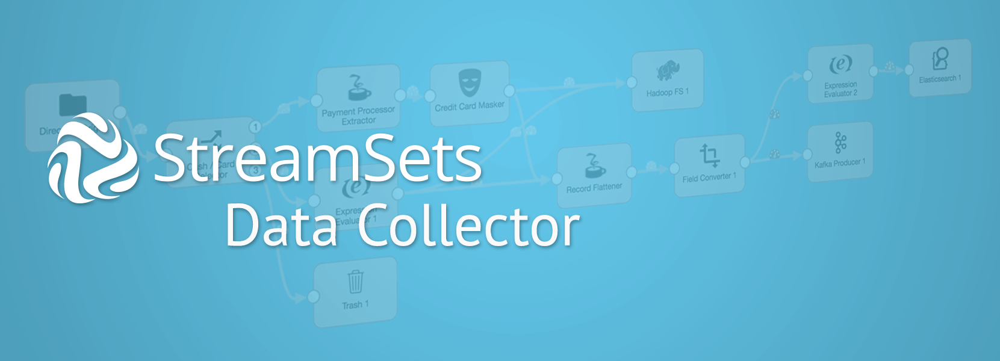

<!---
  Licensed under the Apache License, Version 2.0 (the "License");
  you may not use this file except in compliance with the License.
  You may obtain a copy of the License at

    http://www.apache.org/licenses/LICENSE-2.0

  Unless required by applicable law or agreed to in writing, software
  distributed under the License is distributed on an "AS IS" BASIS,
  WITHOUT WARRANTIES OR CONDITIONS OF ANY KIND, either express or implied.
  See the License for the specific language governing permissions and
  limitations under the License. See accompanying LICENSE file.
--->

What is StreamSets Data Collector?
----------------------------------

StreamSets Data Collector is an enterprise grade, open source, continuous big data ingestion platform.
It has an advanced and easy to use GUI that lets data engineers, data scientists, developers and data infrastructure
teams easily create data pipelines in a fraction of the time typically required to create complex ingest scenarios.
Out of the box, StreamSets Data Collector reads from and writes to a large number of connectors, including Amazon S3, Microsoft ADLS, Google cloud, JDBC-based, Hadoop and file-based, Kafka, and many others. In addition to a large number
of pre-built stages to transform and process the data on the fly, you can also use Groovy, Jython, and JavaScript processors to write custom code.

To learn more, check out [http://streamsets.com](http://streamsets.com)

Building StreamSets Data Collector
----------------------------------
To build the StreamSets Data Collector from source code, [click here for details](BUILD.md).

License
-------
StreamSets Data Collector is built on open source technologies, our code is licensed with the
[Apache License 2.0](LICENSE.txt).

Getting Help
------------

A good place to start is to check out [http://streamsets.com/community](http://streamsets.com/community). You can also various [support options](http://streamsets.com/support).

Contributing Code
-----------
We welcome contributors, please check out our [guidelines](CONTRIBUTING.md) to get started.
